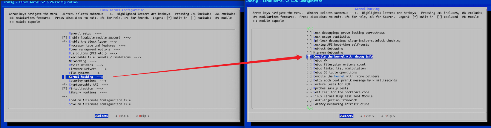

# run-linux-2.6.26
linux-2.6.26 内核使用的 `gcc`、`make` 等编译构建工具较老，新版 `make` 不兼容 linux-2.6.26 中的 `Makefile` 语法。`docker` 可以提供统一的构建边缘环境。

## 编译内核
### 1. 安装 docker
可见 docker 的官方文档：[Install Docker Engine](https://docs.docker.com/engine/install/)。

### 2. 编译环境
拉取已构建好的镜像（推荐）：
``` bash
$ docker pull bitinit/linux-2.6.26-env
```

或者在本地构建镜像：
``` bash
$ git clone https://github.com/BitInit/run-linux-2.6.26.git
$ cd run-linux-2.6.26
$ docker build -t linux-2.6.26-env .
```

可通过以下命令格式来执行相关操作：
``` bash
$ docker run --rm -it -v $(pwd):/src linux-2.6.26-env "<command>"
```
### 3. 编译内核（x86）
获取 Linux 2.6.26 内核：
``` bash
$ wget https://mirrors.edge.kernel.org/pub/linux/kernel/v2.6/linux-2.6.26.tar.gz
```

生成内核配置（.config 文件）
``` bash
$ tar -xzf linux-2.6.26.tar.gz
$ cd linux-2.6.26

# 生成 i386 默认配置
$ docker run -it -v $(pwd):/src bitinit/linux-2.6.26-env "make ARCH=i386 defconfig"
```

可通过 `make menuconfig` 图形化配置内核：
``` bash
$ docker run -it -v $(pwd):/src bitinit/linux-2.6.26-env "make ARCH=i386 menuconfig"
```
在内核的配置中，可开启内核的 Debug 信息，路径为：
```
Kernel hacking --->
    Compile the kernel with debug info
```


执行内核的编译：
```bash
$ docker run -it -v $(pwd):/src bitinit/linux-2.6.26-env "make ARCH=i386 bzImage"

# 可通过 make -j 并行编译
$ docker run -it -v $(pwd):/src bitinit/linux-2.6.26-env "make -j ARCH=i386 bzImage"
```
> 在编译的过程中，会出现以下一些错误：
> ```
> gcc: error: elf_i386: No such file or directory
> gcc: error: unrecognized command line option '-m'
> make[1]: *** [arch/x86/vdso/vdso32-int80.so.dbg] Error 1
> make: *** [arch/x86/vdso] Error 2
> ```
> 将 arch/x86/vdso/Makefile 中 `-m elf_i386` 改成 `-m32`、`-m elf_x86_64` 改成 ` -m64`。
>
> ```
> kernel/built-in.o: In function `mutex_lock':
> /src/kernel/mutex.c:92: undefined reference to `__mutex_lock_slowpath'
> kernel/built-in.o: In function `mutex_unlock':
> /src/kernel/mutex.c:117: undefined reference to `__mutex_unlock_slowpath'
> make: *** [.tmp_vmlinux1] Error 1
> ```
> 在 `kernel/mutex.c` 中 ` __mutex_lock_slowpath` 和 `__mutex_unlock_slowpath` 增加 `__used`：
> ```
> -static void noinline __sched __mutex_lock_slowpath(atomic_t *lock_count);
> +static __used void noinline __sched __mutex_lock_slowpath(atomic_t *lock_count);
> 
> -static noinline void __mutex_unlock_slowpath(atomic_t *lock_count);
> +static __used noinline void __mutex_unlock_slowpath(atomic_t *lock_count);
> ```
> --------

> **为了方便，提供了 fixed.patch 文件，可通过 patch 统一修复这些问题：**
>
> ```
> # 将 run-linux-2.6.26 中的 fixed.patch 复制到 linux-2.6.26 目录中，执行：
> $ patch -p0 < fixed.patch
> ```

编译完后，在 linux-2.6.26 目录中生成 `vmlinux` 文件，和 `arch/x86/boot` 目录中生成 `bzImage` 文件。

## 在 qemu 中运行

待定～
